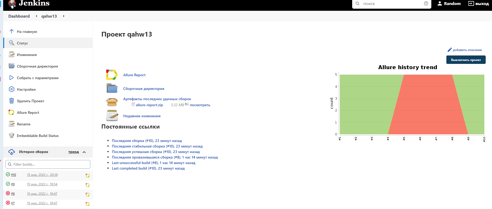
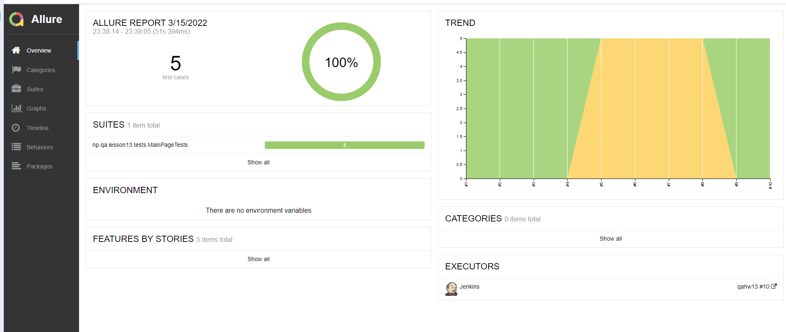
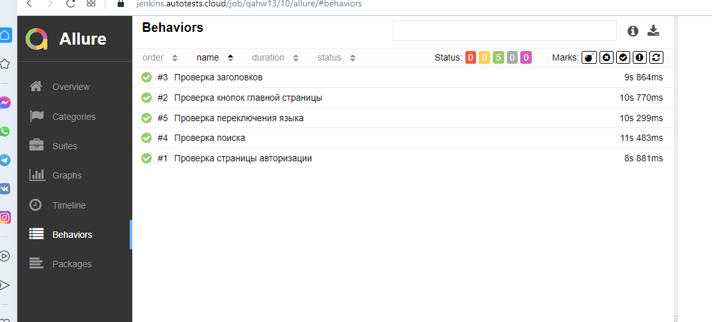
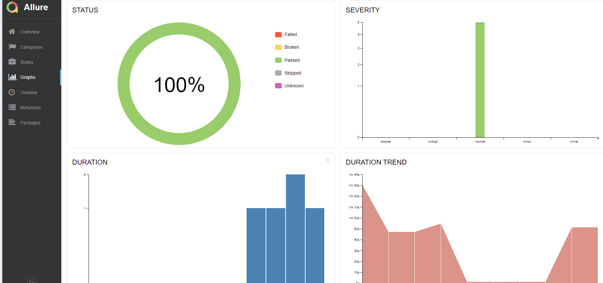
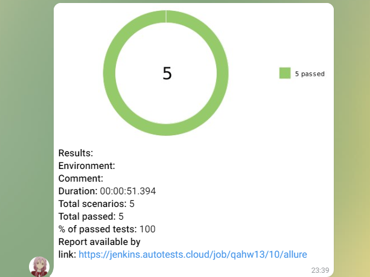
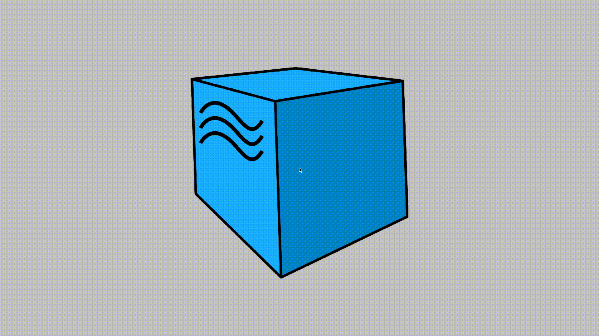

# Проект для домашки(для примера-Википедия)
<a target="_blank" href="https://ru.wikipedia.org/wiki/Заглавная_страница">Wikipedia</a>

## :pushpin: Содержание:

- [Технологии и инструменты](#rocket-технологии-и-инструменты)
- [Реализованные проверки](#-Реализованные-проверки)
- [Сборка в Jenkins](#earth_africa-Jenkins-job)
- [Запуск из терминала](#computer-Запуск-тестов-из-терминала)
- [Allure отчет](#-Тесты)
- [Отчет в Telegram](#-Уведомление-в-Telegram-при-помощи-бота)
- [Видео примеры прохождения тестов](#-Примеры-видео-о-прохождении-тестов)

## :rocket: Технологии и инструменты

<p align="center">
<a href="https://www.jetbrains.com/idea/"></a>
<a href="https://www.java.com/"></a>
<a href="https://github.com/"></a>
<a href="https://junit.org/junit5/"></a>
<a href="https://gradle.org/"></a>
<a href="https://selenide.org/"></a>
<a href="https://aerokube.com/selenoid/"></a>
<a href="https://github.com/allure-framework/allure2"></a>
<a href="https://www.jenkins.io/"></a>
</p>

## Реализованные проверки

- ✓ Проверка поиска.
- ✓ Проверка страницы авторизации.
- ✓ Проверка кнопок главной страницы.
- ✓ Проверка переключения заголовков.
- ✓ Проверка переключения языка.

## </a> Jenkins job
<a target="_blank" href="https://jenkins.autotests.cloud/job/qahw13/">Сборка в Jenkins</a>
<p align="center">
<a href="https://jenkins.autotests.cloud/job/qahw13/"></a>
</p>

### :earth africa: Параметры сборки в Jenkins:

- browser (браузер, по умолчанию chrome)
- browserVersion (версия браузера, по умолчанию 91.0) 
- remoteUrl (Selenoid URL)
- remoteState (дефолтно-true, если false - возможность запускать локально)

## :computer: Запуск тестов из терминала

Локальный запуск:
```bash
gradle clean test
```

Удаленный запуск:
```bash
clean
test

-Duser=${USER}
-Dpass=${PASS}
-DremoteUrl=${REMOTE}
-Dbrowser=${BROWSER}
-DbrowserVersion=${BROWSERVERSION}
```

## </a> Отчет в <a target="_blank" href="https://jenkins.autotests.cloud/job/qahw13/">Allure report</a>

### Основное окно

<p align="center">

</p>

### :classical_building: Тесты

<p align="center">

</p>

### Графики

<p align="center">

</p>

## </a> Уведомление в Telegram при помощи бота

<p align="center">

</p>


### </a> Примеры видео о прохождении тестов

<p align="center">
 
</p>
